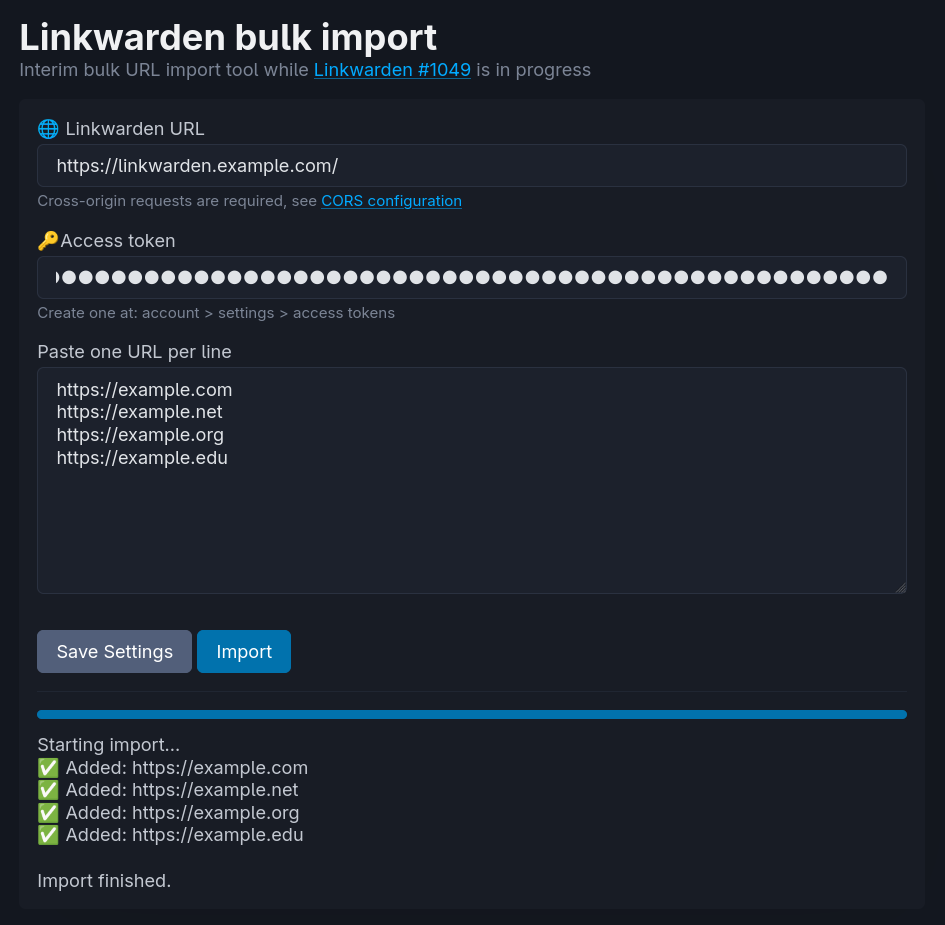
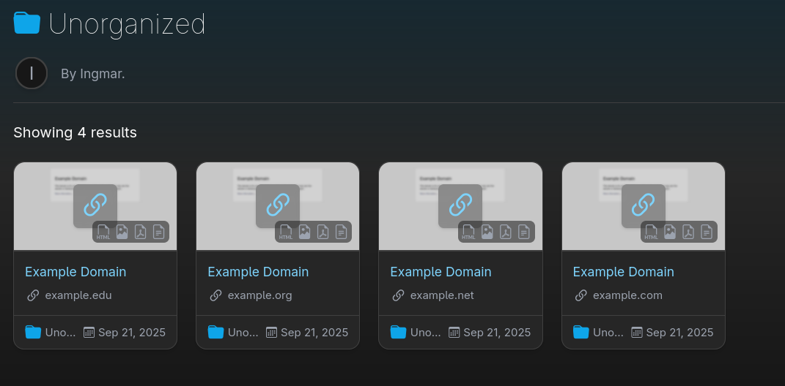

# Linkwarden Bulk Import Tool 

[](https://github.com/idelsink/linkwarden-bulk-import/actions/workflows/gh-pages.yaml)
[](https://opensource.org/licenses/MIT)

A simple web-based tool for bulk importing URLs into [Linkwarden](https://github.com/linkwarden/linkwarden), a self-hosted bookmark manager.

This tool exists because Linkwarden does not (yet) have native bulk import functionality. See the [original discussion](https://github.com/linkwarden/linkwarden/issues/1049) about bulk import functionality.

## :rocket: Live Demo

Try it now at: **[ingmar.dels.ink/linkwarden-bulk-import](https://ingmar.dels.ink/linkwarden-bulk-import)**

## :camera: Screenshots

### Import Interface



### Import Results in Linkwarden



## :thinking: Usage

1. Enter your Linkwarden instance URL (e.g., `https://linkwarden.example.com`)
2. Generate an access token from your Linkwarden instance:
   - Navigate to `Account > Settings > Access Tokens`
   - Create a new token (set an expiration date for security)
3. Click "Save" to save the settings
4. Paste URLs to import (one per line)
5. Click "Import" to start the bulk import process

## :zap: Quick start

### Prerequisites

- [mise](https://mise.jdx.dev/) (for dev tools and task runner)

### Installation

```sh
# Clone the repository
git clone https://github.com/idelsink/linkwarden-bulk-import.git
cd linkwarden-bulk-import

# Install dependencies (if using mise)
mise install

# install dependencies
npm ci

# Start live server
npm run dev
```

## :gear: CORS Configuration

> [!IMPORTANT]
> Your Linkwarden instance needs to be configured to allow cross-origin requests. Without proper CORS headers, the bulk import will fail.

<details>
<summary><b>Traefik Configuration</b></summary>

Add these labels to your Linkwarden container:

```yaml
labels:
  # Attach CORS middleware
  traefik.http.routers.linkwarden.middlewares: "linkwarden-cors"

  # Define the CORS middleware
  traefik.http.middlewares.linkwarden-cors.headers.accessControlAllowOriginList: "*"
  traefik.http.middlewares.linkwarden-cors.headers.accessControlAllowMethods: "GET,OPTIONS,PUT,POST,DELETE"
  traefik.http.middlewares.linkwarden-cors.headers.accessControlAllowHeaders: "Authorization,Content-Type"
  traefik.http.middlewares.linkwarden-cors.headers.accessControlAllowCredentials: "true"
```

</details>

<details>
<summary><b>Nginx Configuration</b></summary>

> [!NOTE]
> This configuration is provided as an example and may need adjustments for your setup.

```nginx
location / {
  # CORS headers
  add_header 'Access-Control-Allow-Origin' '*' always;
  add_header 'Access-Control-Allow-Methods' 'GET, POST, PUT, DELETE, OPTIONS' always;
  add_header 'Access-Control-Allow-Headers' 'Authorization, Content-Type' always;
  add_header 'Access-Control-Allow-Credentials' 'true' always;

  # Handle preflight requests
  if ($request_method = 'OPTIONS') {
    return 204;
  }

  # Your existing proxy configuration
  proxy_pass http://linkwarden:3000;
}
```

</details>

<details>
<summary><b>Caddy Configuration</b></summary>

> [!NOTE]
> This configuration is provided as an example and may need adjustments for your setup.

```caddyfile
linkwarden.example.com {
  header {
    Access-Control-Allow-Origin *
    Access-Control-Allow-Methods "GET, POST, PUT, DELETE, OPTIONS"
    Access-Control-Allow-Headers "Authorization, Content-Type"
    Access-Control-Allow-Credentials true
  }

  reverse_proxy linkwarden:3000
}
```

</details>

## :lock: Security Notes

- 🔐 Access tokens are stored in browser localStorage - use at your own risk
- ⏰ Always set expiration dates on your access tokens
- ⚠️ Be cautious when configuring CORS with wildcard origins (`*`) in production.

## :balance_scale: License

This project is licensed under the MIT License - see the [LICENSE](LICENSE) file for details.
